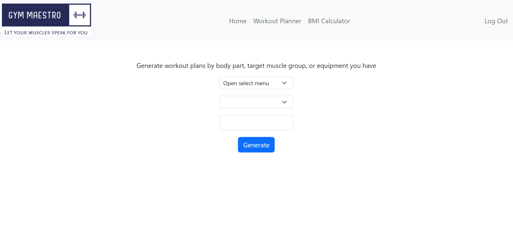
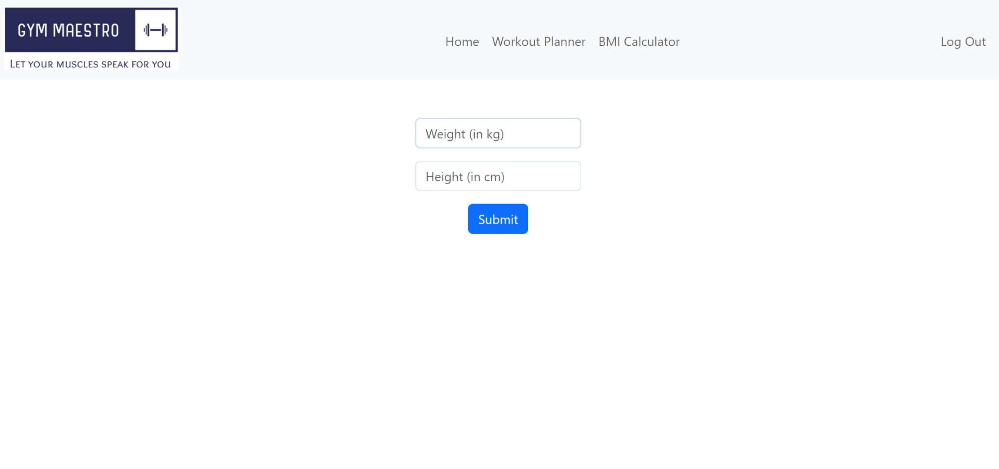

# Gym Maestro: Workout Planner
#### Video Demo:  https://youtu.be/CTbs7Ugvhr4
#### Description: Gym Maestro is a workout planner web app that aids you planning your workouts by generating exercises based on filters that you may select. It includes a workout exercise generator and a BMI calculator as part of the website.

#### Languages/technologies used: Python, Flask, SQLite, HTML, CSS, Javascript, Bootstrap

## Workout Planner:

- Plan your workouts by using the workout planner tab! Generate as many exercises as you want based off the filters that you select.
- You may choose a main filter that allows you to select how you want to generate the exercises. Choose between the following: Body Part, Target Muscle Group, and Equipment.
- Select a 2nd filter with the 2nd dropdown menu to specify the type of Body Part, Target Muscle Group, or Equipment you want. The options available in this menu depends on what is selected in the main filter.
- The last text box is a limit filter that allows you to select the number of exercises you want to generate. Do note that there are a finite number of exercises for each filter, so the generated number of exercises may or may not be less than what is input into this field and is not a bug.

## BMI Calculator:

- Calculate your BMI with the BMI Calculator
- The calculator will let you know your BMI and which of the following ranges it is in:
    - Under Weight
    - Normal Weight
    - Over Weight
    - Obesity class I
    - Obesity class II
    - Obesity class III
- Once you have calculated your BMI, your latest BMI data will be stored in your account and can be viewed at any time on the homepage.

## Implementation
This is the first complete web app I built from scratch, I think I really learnt quite a bit throughout the process. Dipping my toes into making requests using APIs was a first for me but it was much easier than I thought after reading the documentation of the 2 APIs I selected from RapidAPI.

### Future Development
I will probably consider adding a page that will allow users to add in their own custom exercises. While the ease of having exercises generated for you is convenient, powerusers might notice that their favourite exercises may not be included in the list of possible exercises, or the equipment that they own may not be in the list provided. 

## Credits
- Workout Planner API provided by [ExerciseDB](https://rapidapi.com/justin-WFnsXH_t6/api/exercisedb)
- BMI Calculator API provided by [Mega Fitness Calculator](https://rapidapi.com/bejjaothmane/api/mega-fitness-calculator1)

